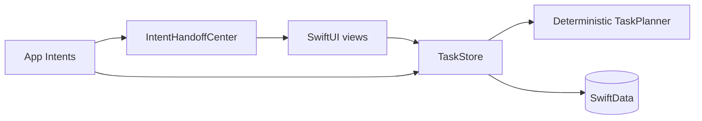

# ClearDay for iOS

ClearDay turns one outcome into a small, scheduled plan without sending personal tasks to a server. The first release is deliberately local-first and subscription-free: task data lives in SwiftData, planning is deterministic and explainable, and four App Intents make the core workflow available to Shortcuts and Siri.

## What works

- Capture tasks with notes, an effort estimate, and an optional deadline.
- Preview a deterministic decomposition before saving.
- Schedule work into weekday blocks between 09:00 and 18:00.
- Review today's blocks, browse all tasks, and mark work complete.
- Use four system actions: add a task, open the planner, open today's plan, and complete the next task.
- Route open-app intents through one observable `IntentHandoffCenter` rather than hidden global navigation side effects.

No account, API key, network connection, or paid service is required.

## Architecture



- `ClearDayTask` is the SwiftData aggregate. Its generated `PlanSnapshot` is stored as Codable data so every saved task retains the exact plan the user reviewed.
- `TaskPlanner` is a pure domain function with keyword-aware decomposition, five-minute allocation, working-hour scheduling, weekend rollover, and deadline warnings.
- `TaskStore` owns validation, planning, insertion, completion, and persistence so the UI and App Intents share behavior.
- `IntentHandoffCenter` is the single runtime path for intents that open the app.

The deterministic planner is also the fallback contract for a future optional AI planner: AI output can be validated into the same `PlanSnapshot`, while offline users keep a complete product.

## Requirements

- Xcode 16 or newer
- iOS 17 or newer
- An installed iOS Simulator runtime for simulator builds and tests

## Build and test

```bash
./scripts/verify.sh
xcodebuild -project ClearDay.xcodeproj -scheme ClearDay \
  -destination 'platform=iOS Simulator,name=iPhone 16 Pro' test
```

`verify.sh` always validates the project and parses every Swift source file. If an iOS Simulator runtime is installed, it also performs a compile build. The UI test launches with an in-memory SwiftData store, creates a task, previews its plan, saves it, and verifies it in the task list.

## Checkpoints and rollback

Install the repository hooks once after cloning:

```bash
./scripts/install-hooks.sh
```

The pre-commit hook runs `scripts/verify.sh`. After each commit, the post-commit hook creates an annotated `checkpoint/<timestamp>-<sha>` tag. Publish checkpoint tags with `git push --follow-tags`.

Restore without rewriting history:

```bash
./scripts/restore-checkpoint.sh
./scripts/restore-checkpoint.sh checkpoint/20260710T150000Z-a1b2c3d
```

The script creates and switches to a new `restore/<timestamp>-<sha>` branch at the selected checkpoint. It never runs `reset`, changes an existing branch, or deletes work.

## Privacy and cost

ClearDay currently has no analytics, ads, account system, cloud sync, or remote AI calls. Source code is released under the MIT License. App Store distribution would eventually require an Apple Developer Program membership, but local development and Simulator use do not.
